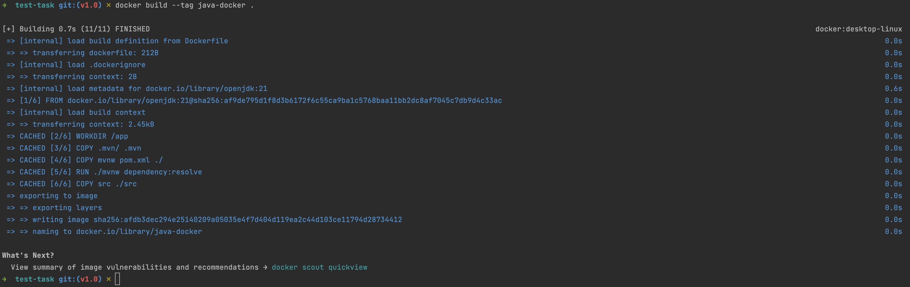

# test-task

## To run through the Docker 

Run this command in terminal from the project directory:
```
docker build --tag java-docker .          
```

<picture>
  
</picture>

```
docker run --publish 8080:8080 java-docker        
```

<picture>
  
</picture>

cURL: 
```
curl --location 'localhost:8080/repositories/{USERNAME}' \
--header 'Accept: application/json'
```

<picture>
  
</picture>